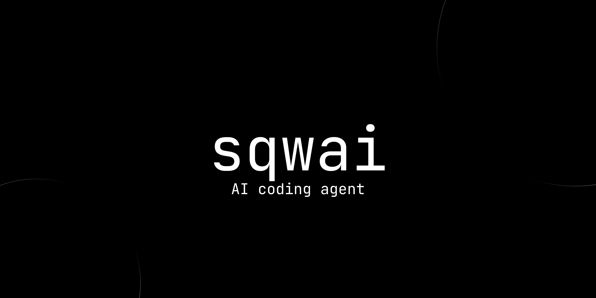

# sqwai

An interactive AI coding agent for the terminal, written in Rust. It works inside a project directory and combines an LLM with a terminal UI, project files, shell commands, sessions, safety checks, and development tools.

## Features

- Inspect and edit project files and run shell commands.
- Stream model responses and tool activity.
- Plan and Act modes.
- Persistent, resumable, forkable sessions with git checkpoints and undo.
- Anthropic, OpenAI-compatible, and OpenAI Responses providers.
- MCP client support for stdio and streamable HTTP, including tool discovery and namespaced calls.
- LSP initialization, file synchronization, and queued diagnostics foundation.
- Compatible `SKILL.md` loader with frontmatter, project overrides, configured directories, and prompt injection.
- Category-based `/settings` hub for Appearance, Providers, MCP, LSP, and Skills.
- Color themes, animated themes, configurable thinking levels, Markdown rendering, and safety approvals.

## Requirements

- Rust and Cargo.
- A configured model provider and API key.
- Git is recommended for checkpoints and undo.

## Build from source

```bash
git clone https://github.com/hksae/sqwai
cd sqwai
cargo build --release
```

The binary is written to `target/release/sqwai` (`.exe` on Windows).

## Installation

Windows:

```powershell
powershell -ExecutionPolicy Bypass -File .\install.ps1
```

Linux and macOS:

```bash
bash ./install.sh
```

## Configuration

On Windows, the default configuration file is:

```text
%APPDATA%\sqwai\config\config.toml
```

Configure a provider, model, endpoint, and API key environment variable. Do not commit credentials. Use `/settings` for the main settings hub; shortcuts such as `/providers`, `/models`, `/themes`, and `/debug` remain available. If the project contains `AGENTS.md`, sqwai loads it as project instructions; `/init` creates a starter file.

### MCP

Configure MCP servers in `mcp`. Enabled stdio and streamable HTTP servers connect asynchronously when an agent turn starts. Tools are exposed with names such as `mcp__server__tool`. Stdio supports command arguments and environment variables; HTTP supports custom headers.

### LSP

Configure LSP servers in `lsp`. The client supports JSON-RPC framing, initialization, `didOpen`, `didChange`, `didSave`, and queued `textDocument/publishDiagnostics` notifications. Full file-mutation runtime wiring is in progress.

### Skills

Skills use compatible `SKILL.md` files with `name`, `description`, and `triggers` frontmatter. They may be loaded from configured directories, the user skills directory, and `.sqwai/skills`; project definitions override earlier ones and loaded skills are added to the agent prompt.

## Run

```bash
sqwai
```

To resume a session directly:

```bash
sqwai --resume <session-id>
```

## Safety and undo

Potentially dangerous shell commands may require approval. File changes are checkpointed through git when possible and can be reverted with `/undo`. Review commands, changes, and diffs before accepting them.

## Development

```bash
cargo fmt --check
cargo check
cargo test
cargo build --release
```

## Roadmap

The project is being developed from its terminal foundation through agent execution, tools and safety, sessions and undo, persistent project memory, MCP/LSP/Skills, and final stabilization and packaging.

## License

Licensed under the [Apache License 2.0](LICENSE).
